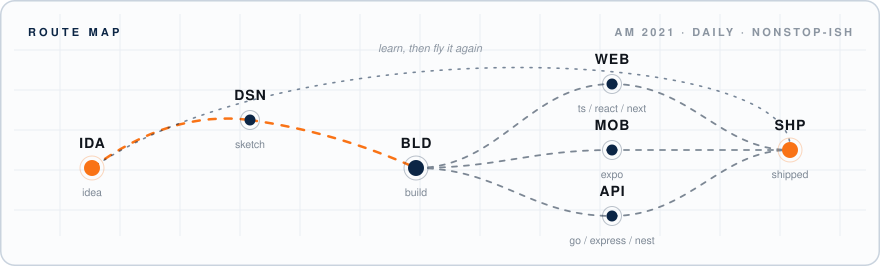

## ✈️ &nbsp;itinerary

## 🧳 &nbsp;cabin baggage

| deck | packed |
| :--- | :--- |
| **front** | typescript · react · next.js · astro |
| **mobile** | expo |
| **back** | go · php · nest.js · express.js |
| **ground crew** | git · docker · figma |

 

<b>📢 &nbsp;in-flight announcement</b> &nbsp;<i>(tap to expand)</i>

 

Full-stack developer — happiest where the web, mobile and the server meet.

I like small components, boring architectures and interfaces that don't need a manual. Most of my flying happens in private repos while i sometimes contribute to opensource ones too, so this profile is quieter than the workload. That'll change as things land. building in public is the way!

Currently: building end to end, shipping small, learning loudly.

## 🛫 &nbsp;departures

| destination | gate | status |
| :--- | :--- | :--- |
| linkedin | [`/in/mxmdhr`](https://www.linkedin.com/in/mxmdhr/) | boarding |
| x | [`@mxmdahir`](https://x.com/mxmdahir) | boarding |
| inbox | [`mohameddahir709@gmail.com`](mailto:mohameddahir709@gmail.com) | always open |

 
<i>the pass above is a hand-written SVG — no third-party services, no trackers, just paper that learned to fly</i>
  

