<div align="center">



<a href="https://www.linkedin.com/in/mxmdhr/"></a>
<a href="https://x.com/mxmdahir"></a>
<a href="mailto:killavilla79@gmail.com"></a>

</div>

---

### `~/stack`

```ansi
$ tree ~/stack --dirsfirst
.
├── web/        typescript · react · next.js · node
├── mobile/     swift · kotlin · flutter
├── backend/    go · rust · java · c#
└── tools/      git · docker · figma · the terminal

4 directories, 0 frameworks worshipped
```

### `~/now`

```diff
+ building full-stack products, web → mobile → back again
+ learning in public, shipping small and often
! most of the good stuff still lives in private repos
```

### `~/principles`

> Make it work. Make it clean. Then make it look like it was easy.

<div align="center">
<br>
<sub><i>the terminal above is a hand-written SVG — no third-party services, no trackers, just <code>&lt;rect&gt;</code>s that learned to type</i></sub>
<br><br>

</div>
